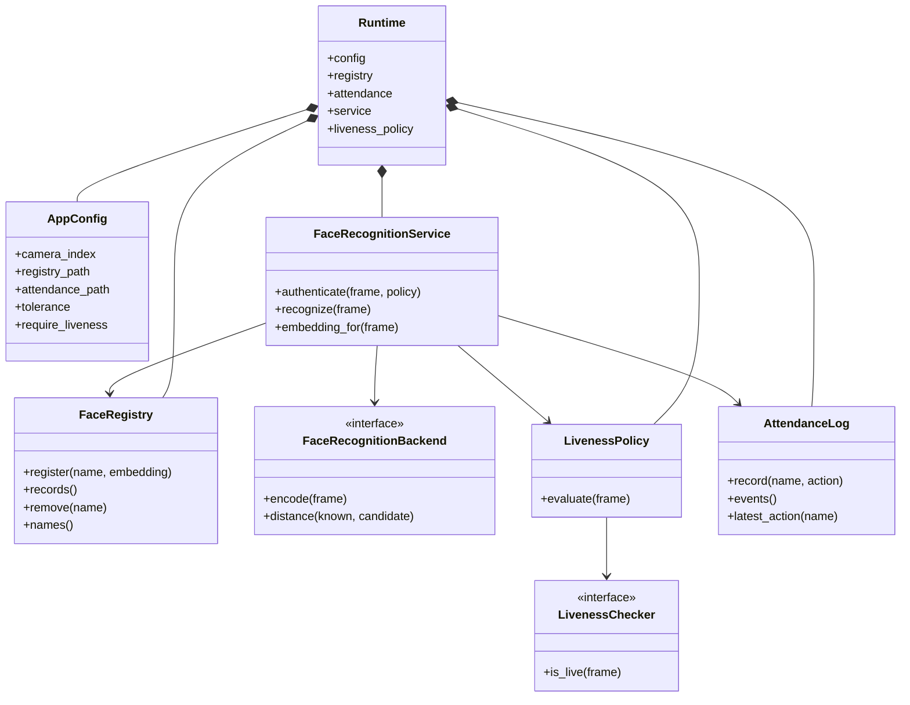
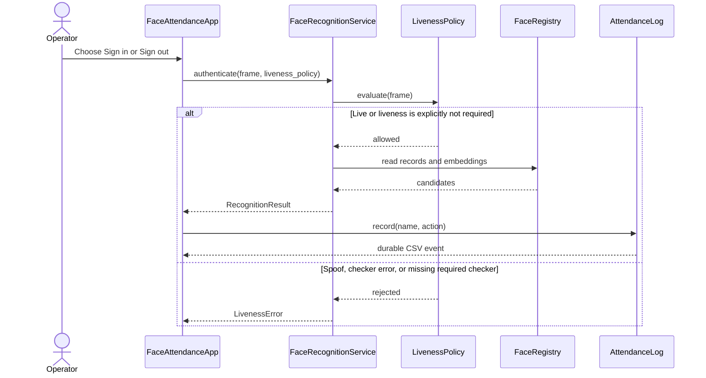

# Face Attendance

A local face recognition attendance system with a Tkinter desktop app and a scriptable CLI. It stores face embeddings rather than camera images, keeps the core logic testable without a display, and supports configurable liveness integration.

[](https://github.com/ogc16/face-recognition/actions/workflows/ci.yml)

## Project governance

- [MIT License](LICENSE)
- [Security policy](SECURITY.md)
- [Contributing guide](CONTRIBUTING.md)
- [Code of conduct](CODE_OF_CONDUCT.md)

## What is included

- Live webcam capture with a configurable camera index
- Face registration with normalized, case-insensitive names, validation, and multiple samples per user
- Single-face recognition with a configurable distance tolerance
- Sign-in and sign-out events in a local CSV log
- Atomic, versioned JSON embedding storage without `pickle` deserialization
- Interprocess file locking for registry and attendance updates
- Optional pluggable liveness checking with a fail-closed required mode
- CLI commands for initialization/validation, registration, recognition, user listing/removal, and attendance output
- Dependency-injected core services covered by unit tests

## Requirements

- Python 3.10 or newer
- A webcam and a working camera driver for the desktop app
- Tkinter from the Python installation
- A supported compiler/toolchain for `dlib` when installing `face-recognition` on Windows
- The project pins the `setuptools` runtime required by `face_recognition_models`

Model data is supplied by the `face-recognition-models` dependency rather than this repository. Camera and model behavior must be verified on the deployment machine.

## Dependency map

The canonical dependency declaration is the root [`pyproject.toml`](pyproject.toml). The project does not bundle model weights or a labeled face dataset, and it does not require a GPU framework such as PyTorch or an additional vector database such as FAISS for its default single-process design.

| Area | Dependencies | Purpose |
| --- | --- | --- |
| Face detection and encoding | `face-recognition`, `face-recognition-models`, `opencv-python`, `numpy`, `Pillow` | 128-dimensional face embeddings, model assets, camera frames, and array/image operations |
| Native model runtime | `dlib` (transitive dependency of `face-recognition`), `setuptools` | Face-landmark and embedding model runtime |
| Development | `pytest`, `pytest-cov`, `ruff`, `mypy` | Tests, coverage, linting, formatting, and static typing |

`dlib` may require Visual Studio Build Tools and CMake on Windows when no compatible wheel is available. Keep the runtime and development dependency sets in `pyproject.toml` rather than maintaining a second, drifting requirements file.

## Setup

Create an environment and install the project with its development tools:

```text
python -m venv .venv
.venv\Scripts\activate
python -m pip install --upgrade pip
python -m pip install -e ".[dev]"
```

On macOS and Linux, activate the environment with `source .venv/bin/activate`.

Launch the desktop app from the checkout with:

```text
python main.py
```

Installed environments can use `python -m face_attendance` or `face-attendance-gui`.

On Windows, `face-recognition` depends on `dlib`. If pip attempts to build `dlib` from source, install Visual Studio Build Tools and CMake, or use a Python/platform combination with a compatible prebuilt wheel.

## Configuration

Copy `config.example.json` to `config.json` and pass it with `--config`:

```text
python main.py --config config.json
python -m face_attendance.cli --config config.json list
```

Environment variables override values from the configuration file:

| Setting | Environment variable |
| --- | --- |
| Camera index | `FACE_ATTENDANCE_CAMERA_INDEX` |
| Registry path | `FACE_ATTENDANCE_REGISTRY_PATH` |
| Attendance path | `FACE_ATTENDANCE_ATTENDANCE_PATH` |
| Match tolerance | `FACE_ATTENDANCE_TOLERANCE` |
| Require liveness | `FACE_ATTENDANCE_REQUIRE_LIVENESS` |
| Samples per user | `FACE_ATTENDANCE_MAX_EMBEDDINGS` |
| Window size | `FACE_ATTENDANCE_WINDOW_WIDTH`, `FACE_ATTENDANCE_WINDOW_HEIGHT` |

Unknown `FACE_ATTENDANCE_*` variables and unknown JSON keys are rejected so misspelled security settings cannot silently fall back to defaults. The default tolerance is `0.6`. Lower values are stricter and can reject valid matches; higher values increase false accepts. Register several samples per user when lighting or angles vary. Liveness is required by default; set `require_liveness` to `false` only on a controlled, trusted workstation where that trade-off is understood.

The default data paths are relative to the current working directory:

- `data/registry.json`
- `data/attendance.csv`

For a sensitive deployment, configure absolute paths on an access-controlled local disk rather than a repository, synchronized folder, or removable drive.

## Desktop workflow

1. Start the app and wait for a camera frame.
2. Select **Register user**, enter a name, and capture a face sample.
3. Add several samples for the user when practical.
4. Use **Sign in** after recognition; use **Sign out** to record the matching departure.
5. Select a user in the registered-user list to remove obsolete face data after confirmation.
6. Review the CSV file for the append-only attendance history.

Attendance transitions are enforced: the first event for a user must be `in`, repeated `in` events are rejected, and `out` is accepted only while the user is signed in. The attendance reader caches validated state and refreshes it when the file changes, avoiding a full CSV reparse for every append. Recognition and attendance processing run in a bounded worker thread; results are delivered back to Tkinter on the UI thread.

Enrollment is intentionally operator-trusted in this lightweight application and does not require liveness. Anyone with access to the desktop or CLI can register a new identity, so deploy the app only on a controlled workstation. Add administrator authorization before using it as a high-assurance enrollment system.

## CLI

Run the installed `face-attendance` command or the module directly:

```text
python -m face_attendance.cli init
python -m face_attendance.cli doctor
python -m face_attendance.cli register "Ada Lovelace" photo.jpg
python -m face_attendance.cli recognize photo.jpg
python -m face_attendance.cli list
python -m face_attendance.cli remove "Ada Lovelace"
python -m face_attendance.cli attendance
```

`init` creates the versioned registry and an attendance CSV header. `doctor` validates both data files without importing the vision model. `register` accepts an image containing exactly one face. `recognize` exits with status `0` for a match, `2` for no match/no face/multiple faces, and `1` for configuration, dependency, liveness, or file errors. `remove` deletes only the selected user's stored embeddings; it does not rewrite attendance history. The `attendance` command prints events as tab-separated text.

The CLI has no bundled liveness model. With the default `require_liveness: true`, recognition fails closed unless a checker is supplied through the programmatic `build_runtime` API. Set the option to `false` only for controlled deployments that explicitly accept the risk.

## Liveness integration

Liveness checking is pluggable because a robust anti-spoof model is deployment-specific. Pass a `LivenessChecker` to `build_runtime`:

- `true` (default) requires a checker and rejects authentication when it is missing, errors, or reports a spoof.
- `false` permits recognition when no checker is configured; the desktop app clearly displays that liveness is unavailable.
- A checker receives the same RGB frame used by the recognition backend.

No high-assurance anti-spoof guarantee is provided by the default deployment. The legacy `util.recognize` helper is also fail-closed by default; callers must provide a checker or explicitly set `require_liveness=False`.

## Data, privacy, and migration

- Embeddings are stored as JSON in the configured registry path.
- Camera frames are not written to disk.
- The old pickle-based database format is intentionally not loaded; re-register users once after migration.
- Names and attendance events are personal data; obtain consent and follow applicable biometric-privacy requirements.
- Registry and attendance files are created with restrictive permissions where the platform supports them. Still restrict access to the registry, attendance CSV, backups, and logs; `.gitignore` prevents the default `data/` directory from being committed, but it does not prevent cloud synchronization.
- Deleting a file is not a guaranteed secure erasure on SSDs, snapshots, or cloud backups; use an approved data-retention and disposal process.

## Development

The core modules use dependency injection, so recognition, persistence, attendance, configuration, liveness, and file-transition behavior can be tested without a webcam or the optional vision libraries.

```text
python -m pytest
python -m ruff check .
python -m ruff format --check .
python -m mypy
```

The repository also runs these core checks on Ubuntu and Windows through GitHub Actions. Live camera capture, `dlib` installation, model accuracy, and anti-spoof integration still require deployment-machine testing.

## Architecture

The application separates entry points, policy, vision integration, and durable
storage so the core can be tested without a camera or display:

```text
main.py
├── face_attendance
│   ├── config.py          # JSON/environment configuration
│   ├── registry.py        # Versioned JSON embedding store
│   ├── file_lock.py       # Cross-process data-file locking
│   ├── recognition.py     # Face matching and policy enforcement
│   ├── attendance.py      # CSV event log and state transitions
│   ├── liveness.py        # Pluggable liveness policy
│   ├── gui.py             # Tkinter desktop workflow
│   ├── cli.py             # Scriptable commands
│   ├── runtime.py         # Dependency assembly
│   └── validation.py      # Names and embedding validation
├── tests/                 # Fake-backend unit and integration tests
├── .github/workflows/     # Cross-platform CI
├── LICENSE
├── SECURITY.md
├── CONTRIBUTING.md
└── CODE_OF_CONDUCT.md
```

### Core class diagram



### Authentication flow



### Data flow and durability

1. `AppConfig` combines JSON settings with environment overrides and rejects
   unknown keys.
2. `Runtime` assembles the registry, attendance log, recognition service, and
   liveness policy.
3. The GUI or CLI supplies a frame to the recognition service. The service
   evaluates liveness before matching, and the default policy fails closed when
   a required checker is missing.
4. A successful match is written to the append-only CSV log. Sign-in and
   sign-out transitions are validated under a cross-process file lock.
5. Registry updates are validated and atomically replaced; camera frames are not
   persisted by this application.

The GUI performs recognition and attendance work in a worker, but only the Tk
main thread updates widgets. The CLI uses the same services without requiring a
display. `doctor` validates both data files without importing the vision model.

## Accuracy and benchmarks

This repository does not include a consented, labeled face dataset or model
weights, so it does not claim a universal recognition accuracy, false-accept
rate, or false-reject rate. Those values depend on the camera, lighting,
demographics, enrollment quality, and the upstream face-recognition model.

Use the following process to produce deployment-specific measurements:

1. Collect a consented evaluation set with genuine and, where appropriate,
   presentation-attack samples.
2. Fix the camera, lighting, enrollment procedure, and distance tolerance before
   measuring results.
3. Report false accepts, false rejects, and confidence distributions separately
   for each relevant group and attack type.
4. Re-run the measurement after changing the model, tolerance, or liveness
   policy.

The default distance tolerance is `0.6`. It is a starting configuration value,
not an accuracy guarantee. Lower values are stricter; higher values increase
false accepts. Liveness checking is fail-closed by default, but the repository
does not bundle an anti-spoof model, so a high-assurance deployment must supply
and validate its own `LivenessChecker`.

The current automated suite contains 70 tests and can be measured with:

```text
python -m pytest --cov=face_attendance --cov-report=term-missing
```

A local attendance-write measurement on the development machine recorded
approximately `3.878 s` for 100 events and `56.214 s` for 1000 events. This
number is hardware- and storage-dependent; it measures durable CSV writes, not
face-recognition accuracy.

## License

This project is released under the [MIT License](LICENSE).

## Troubleshooting

- **Missing dependencies:** install the project with `python -m pip install -e .` and confirm `python -c "import cv2, face_recognition, PIL"`. If the model import reports missing `pkg_resources`, reinstall with the pinned `setuptools` runtime included in project dependencies.
- **No camera frame:** check the camera index, close other applications using the camera, and confirm camera permissions.
- **Unknown face:** add more samples, improve lighting, and tune tolerance only with local testing; do not treat a larger tolerance as a security control.
- **Headless launch error:** use the CLI for non-interactive workflows or run the GUI on a host with a desktop display.
